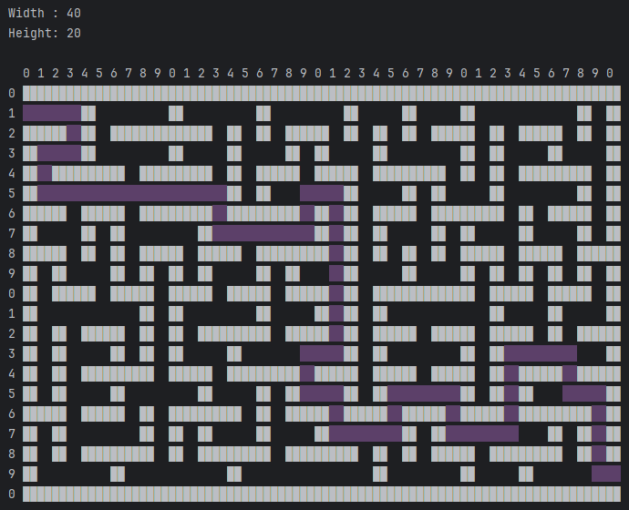
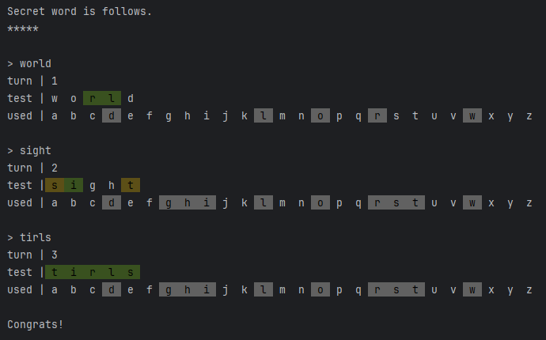

Java Toybox
================================================================================

Toybox with assortment of Java practice exercises.


Requirements
--------------------------------------------------------------------------------

- Java 21


Maze
--------------------------------------------------------------------------------

Maze builder with left-hand rule and right-hand rule route explorers.

```bash
./mvnw clean package && java -jar maze/target/maze-1.0-SNAPSHOT.jar 40 20
```

Demo




Hit and Blow
--------------------------------------------------------------------------------

Hit and Blow hits the hidden 1-9 digit numbers.

```bash
./mvnw clean package && java -jar hitnblow/target/hitnblow-1.0-SNAPSHOT.jar 4
```

Demo

```
Secret code is 4-digits.
****

> 1234
turn | 1
hit  | 0
blow | 3

> 5678
turn | 2
hit  | 1
blow | 0

```


Wordle
--------------------------------------------------------------------------------

Wordle with words from the dictionary.

The dictionary uses the following.<br>
https://gist.github.com/dracos/dd0668f281e685bad51479e5acaadb93

```bash
./mvnw clean package && java -jar wordle/target/wordle-1.0-SNAPSHOT.jar
```

Demo




Shiritori
--------------------------------------------------------------------------------

Shiritori using the given dictionary file.

```bash
./mvnw clean package && java -jar shiritori/target/shiritori-1.0-SNAPSHOT.jar
```

Demo

```
Dictionary file path is /java-toybox/shiri-dict.txt

> あるてぃみしあ
head | あ
tail | あ

< あいずおんみー
head | あ
tail | み
```
